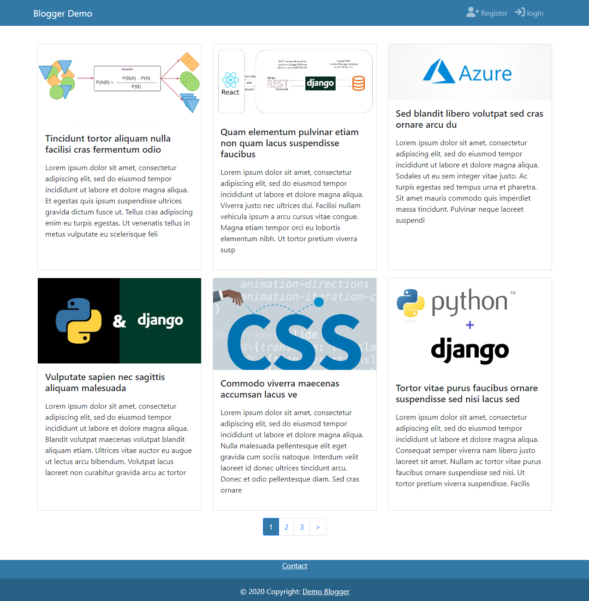

## Blogger App

Key features:  
    - User authentication using Django's default system.  
    - User-friendly sign-up process with password change and reset options. 
    - Post creation functionality for users. 
    - Profile editing for users. 
    - Implementation of <em>Celery</em> worker for background tasks, specifically sending emails. 
    - Use of <em>Redis</em> as message broker and for caching.  

#### Running Blogger app locally on your system
- Install <em>git</em> and <em>docker</em> in your system.
- Clone the repository  
`git clone git@github.com:yogesh-shrestha/blog-app-test-driven.git`
- Change directory  
`cd blog-app-test-driven`
- Build and Run the images (multi-container application)  
`docker-compose up --build` 

Development server starts at http://localhost:8000/. Fake SMTP Server runs at http://localhost:5000/ ( https://github.com/rnwood/smtp4dev).

<b>Superuser credentials </b>  
username: admin 
password: admin 

### Entity-Relationship Diagram 

### HomePage

