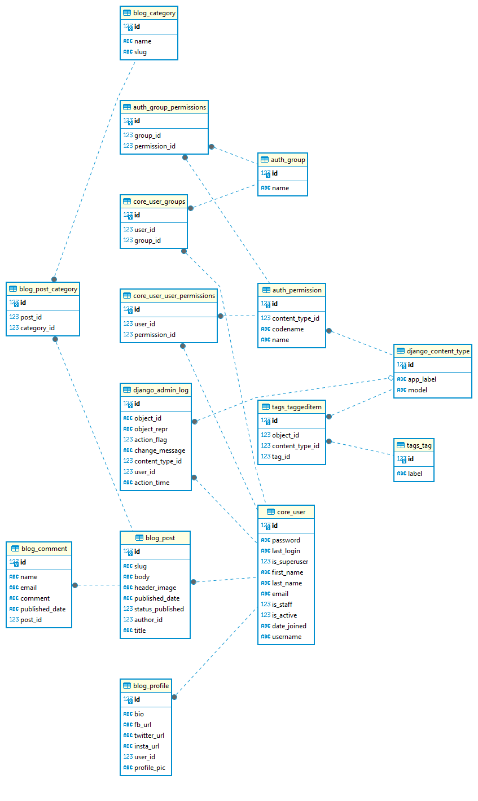

## Blogger App
Blooger app where users can sign up and start adding posts.

Key features:  
    - Sending emails (filling up contact form and sending email). Fake SMTP server <em> Smtp4dev </em> is used for it.  
    - Use of <em>Celery</em> to take email sending task off the request/response cycle.  
    - Use of <em>Redis</em> as message broker and for caching.  

#### Running Blogger app locally on your system
- Clone the repository  
`git@github.com:yogesh-shrestha/blog-app-test-driven.git`
- Change directory  
`cd blog-app-test-driven`
- Build and Run the images (multi-container application)  
`docker-compose up --build`

Fake SMTP Server runs at http://localhost:5000/  
Development server starts at http://localhost:8000/

<b>Superuser credentials </b>  
username: admin 
password: admin 

### Entity-Relationship Diagram 

### HomePage

